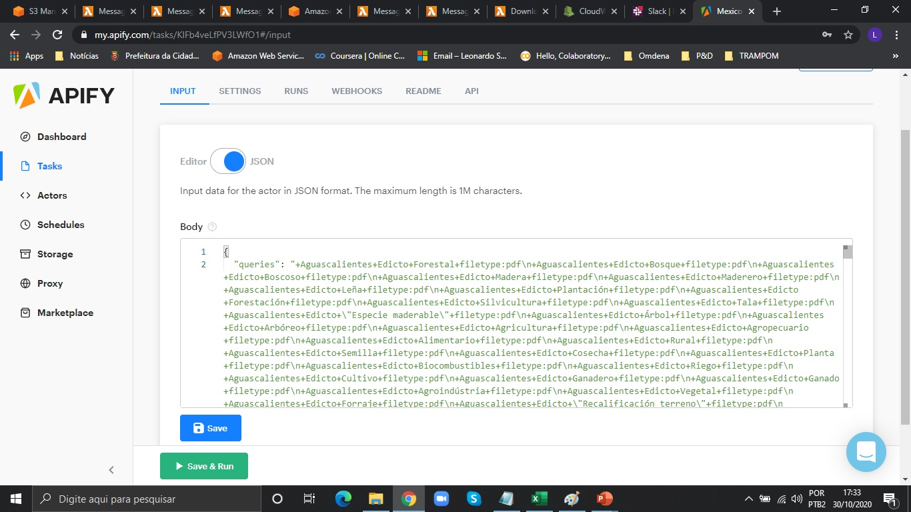
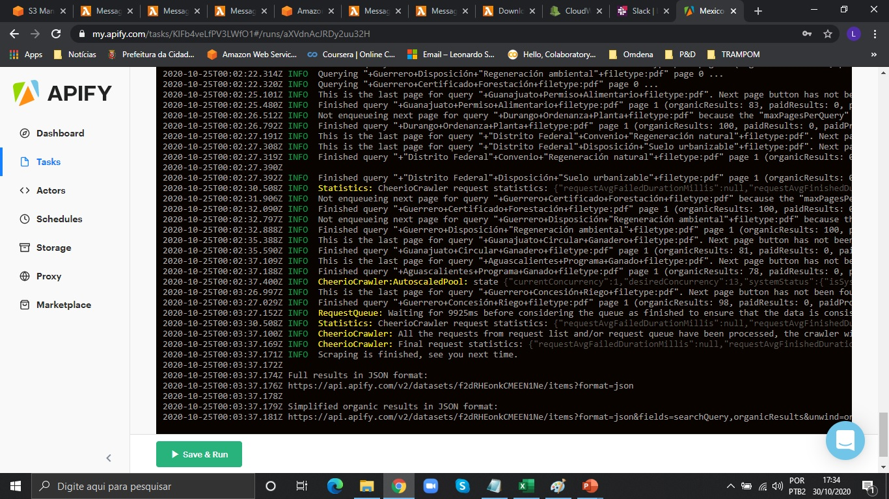
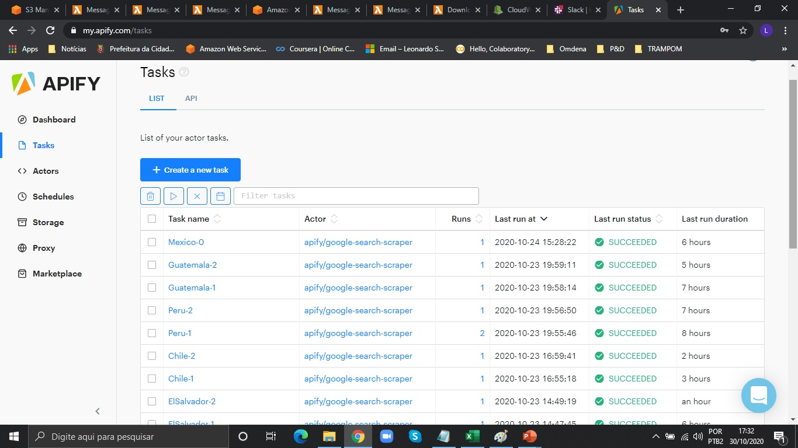
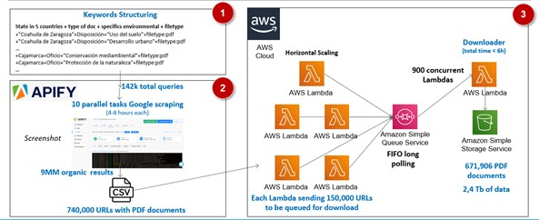
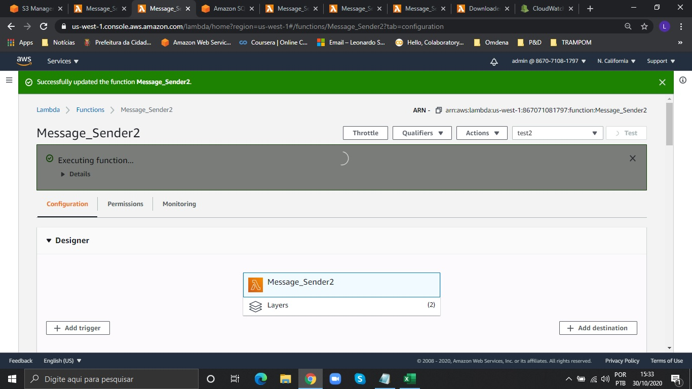
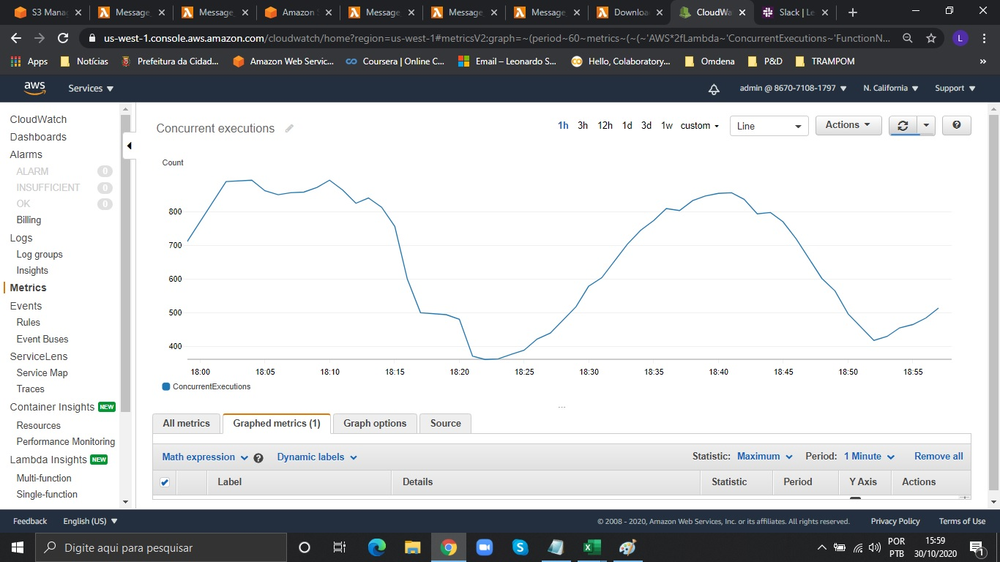

# How to Create a Huge Dataset of PDFs for NLP projects

This file details the technical solution built for this. For more details about the context of this project and about the solution itself, please reference the medium article below:
### Medium Article

See [Creating a Dataset of 700,000 PDFs for NLP in 14 Hours to Help the Planet](https://medium.com/omdena/creating-a-dataset-of-700-000-pdfs-for-nlp-in-14-hours-to-help-the-planet-a821fa6f801d) for more  details

#### INTRODUCTION

This Project was developed as a challenge at Omdena to help the World Resources
Institute (WRI) by applying NLP to identify financial incentives for forest and landscape
restoration. The focus was on Latin America (most specifically Mexico, Peru, Chile,
Guatemala, and El Salvador).

Using NLP to mine policy documents, it is possible to promote knowledge sharing between
stakeholders and enable rapid identification of incentives, disincentives, perverse
incentives, and misalignment between policies.

If a lack of incentives or disincentives were discovered, this would provide an opportunity
to advocate for positive change. Creating a systematic analysis tool could enable a
standardized approach to generate data that can help craft policies that restore more
degraded land more quickly.

In the beginning, we had a starting dataset of a few dozens of PDFs provided by WRI to allow us to train the NLP models and we established a task team to web scrape many more as these models are heavily dependent on lots of data.

The main sources of policies for the five countries were the websites of the Federal Official Gazettes. We successfully accessed each one and by using Scrapy and Selenium we retrieved tens of thousands of documents. Besides the federal documents we also needed to retrieve policies from the state and regional levels to train the NLP algorithms to work at the scales WRI needed.

However these five countries have 108 states and regions in total and accessing each of the Official Gazettes for each of these would be impractical as we neither had enough time, nor the computational resources and team size needed.

To overcome this problem and quickly build a huge dataset this solution was built combining Apify (www.apify.com) and AWS.

#### 1. Keywords Structuring
First the native spanish speaker members of our team created a long list of keywords of interest. All related to the problem of scraping relevant policies in many different geographies. Words like:

+"Coahuila de Zaragoza"+Disposición+"Uso del suelo"+filetype:pdf
+"Coahuila de Zaragoza"+Disposición+"Desarrollo urbano"+filetype:pdf
…
+Cajamarca+Oficio+"Conservación mediambiental"+filetype:pdf
+Cajamarca+Oficio+"Protección de la naturaleza"+filetype:pdf
…

All of these Keywords followed a structure like: 

[**Geo Keywords** — for each of the 108 states and regions] + [**Type of legal documents keywords**] + [**Knowledge Domain Keywords** — specific to the environmental terms we were looking for] + **filetype: pdf** (as we just wanted PDFs).

This way we´ve managed to build JSONs for each country. The ones in the JSONs folder. We splitted them to gain speed by having parallel Apify actors and also to fit the input format of Apify´s console as we decided to not upload them programmaticaly as we had little time.

#### 2. Using Apify to Google Scraping

Then we uploaded each JSON via Apify´s console:

Besides the Keywords many parameters need to be set like language (Spanish), country code (for each one), number of results per page (with a number bigger than 100 results per query the retrieved URLs became too much unrelated to our query. We chose 100 results per page to be faster as possible), number of concurrent queries (we established the maximum value (100) for it to be as fast as possible), exact geolocation (one for each country), among many other parameters.

For each JSON uploaded, we created a task to download them from Google. 

We ran concurrently all JSONs in parallel tasks.

After running all tasks we exported Apify´s results for each task and then combined all URLs generated into a single CSV file (file URLs in this repo), deduplicating URLs in this step. This way we achieved 738,600 unique URLs of PDFs to be downloaded. 
After this we processed the results using a jupyter notebook (Preparing_files_for_AWS_Lambda.ipynb) to change states in blank or rename them so their names could be accepted as S3 folders (basically we took off the accent marks) and at last to create the files to be used in AWS Lambda in chunks of less than 150k URLs. As AWS Lambda has a execution running time limit of 15 minutes, a few tests were made to define the size for these chunks, and the 150k was an optimum size as it neared the 15 minutes. This way 5 files were created as 5 AWS Lambdas would be used.

#### 3. Setting the serverless AWS Architecture

The general solution was built using AWS Lambda, SQS and S3. As can be seen in this image, each message was sent (by AWS Lambda Message Sender) and stored in an SQS FIFO queue. At the other end and in the same time, a 2nd Lambda function was built to execute in response to an SQS event (for example a message reaching the queue). This 2nd Lambda function (Downloader) retrieved messages from the SQS FIFO queue, downloaded data using the message information, and pushed the data to AWS S3 for storage. Exploring more into details:
First AWS Lambda requires the python packages which are not standard and will be used in code to be uploaded as Layers. 

Then for each of the 5 Message Senders the zip files containing the Python code and the URLs in the CSV were uploaded to AWS Lambda.
The design option for the Lambda handler was for using batches of 10 messages to be sent to SQS as this is quicker and this way the handler doesn´t run out of time. 
AWS SQS was set to be used in Fifo mode to guarantee that the processing of each message would be done exactly once and that the first one in would be the first one out too. Both visibility timeout and message retention period were set to be high in order to be able to download all messages by the Downloader Lambda.
During the peak and by using concurrency between lambda functions it was possible to have up to 900 concurrent executions as can be seen here:

The whole architecture ran for 5,5 hours.
 
At last all files were stored in S3 in a format Country/State/Name of the file.

